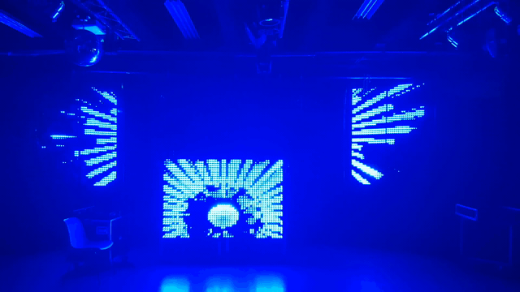

# Led Wall
The DJ is in the center (and we remove the chair before the party).

## What is this repository for?

* This is the Spout Driver for the ledwall. It gets video stream from Arena or other Spout sender and send it to the Ledwall.
* Version 1

## How do I get set up?

* Summary of set up
You need SDL to make this driver work.
* Deployment instructions
Use Code::Block to compile

## Contribution guidelines

Feel free to contribute.
* ToDo : 
Graphical interface

## Who do I talk to?

For any questions, contact Piotr Wolski @Telecom
